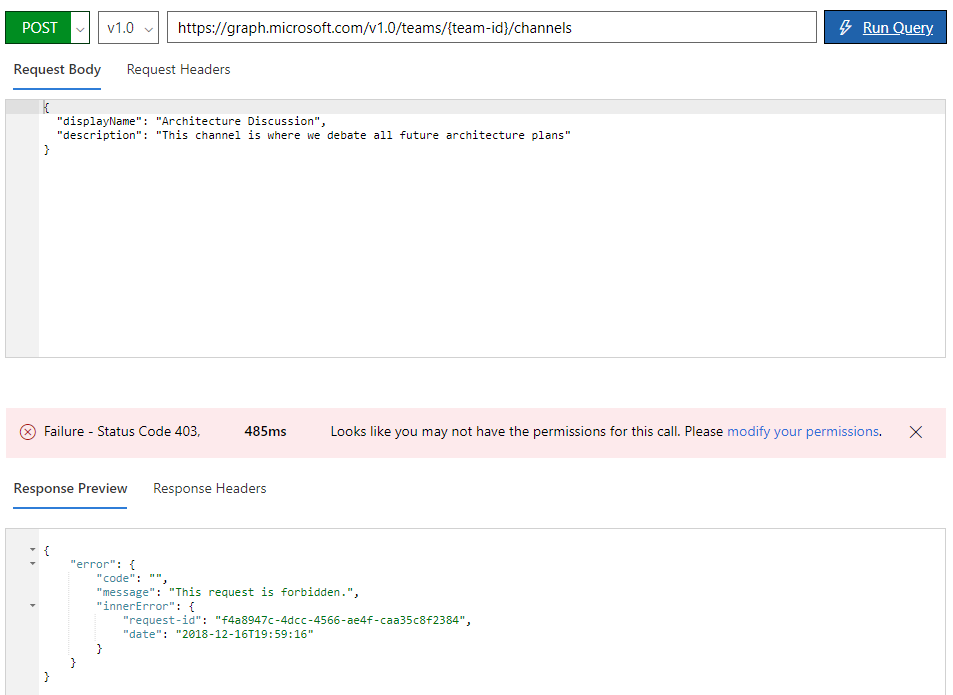
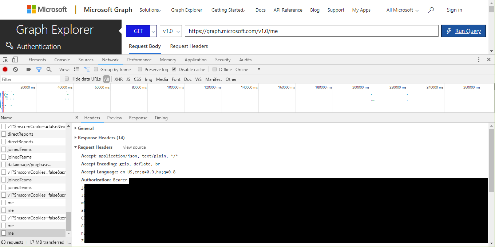

# Lombiq HipChat to Microsoft Teams Migration Utility Readme

Utility to migrate Atlassian HipChat content to Microsoft Teams. You can use this instead of waiting for [official support](https://microsoftteams.uservoice.com/forums/555103-public/suggestions/16933120-importing-from-slack-hipchat-flowdock-basecamp). We're testing this utility at [Lombiq Technologies](https://lombiq.com) (a web development company working with Microsoft technologies) with a 4GB+ HipChat export package containing more than 200k messages (in rooms; a lot more with private chats). The tool is intended for very technical users and developers.

Currently the app can import rooms, messages and attachments from a HipChat export file into configured Teams channels or existing channels (in configured teams). Messages will appear under the user's name doing the import, but messages will include the name of the original user too. To overcome the rate limit of the Teams API multiple HipChat messages can be imported into a single Teams message. See [the issue tracker on GitHub](https://github.com/Lombiq/HipChat-to-Microsoft-Teams-Migration-Utility/issues) for missing features and bugs. HipChat `/quote` and `/code` commands are converted into their Teams equivalents.

Note that this being a utility with just temporary use simplicity of implementation was favored against long-term maintainability. Note that the guide assumes you're using Windows but everything should work equally well under any OS supported by .NET Core. However, released executables are available only for Windows 64b currently.

## Running the app

If you're a .NET developer then grab the latest source and run the app from the source (you'll need at least VS 2017 and 2.2 of the .NET Core SDK). Otherwise download the latest release from [GitHub](https://github.com/Lombiq/HipChat-to-Microsoft-Teams-Migration-Utility/releases) and run the exe file in the zip. Be sure to check the full usage guide below.

## Usage

Keep in mind that you need to be both a HipChat and a Teams admin in your company for this to work.

1. As a HipChat admin export your HipChat data from under you HipChat URL (e.g https://lombiq.hipchat.com), Group admin, Data export. Select to export every kind of data and the whole history. **Use a password without any special characters or spaces!** Save the file under a path without any special characters.
2. Download the OpenSSL binaries if your system doesn't have them already. Recommended is the 1.0.2a (not any other version!) x64 zip from [here](https://bintray.com/vszakats/generic/openssl/1.0.2a) ([direct link to file](https://bintray.com/vszakats/generic/download_file?file_path=openssl-1.0.2a-win64-mingw.zip)). Unzip it to a folder whose path doesn't contain any special characters or spaces, run *openssl.exe* and decrypt the export file with the following command: `aes-256-cbc -d -in C:\path\to\export\file.tar.gz.aes -out C:\export.tar.gz -pass pass:password`.
3. Use your favorite ZIP utility ([7-Zip](https://www.7-zip.org/) recommended) to extract the gz and tar so finally you'll end up with an unencrypted, unzipped export folder (this will contain folders like *rooms* and *users* and some further files like *rooms.json* and *users.json*). If you get a "The parameter is incorrect" error in 7-Zip then first unzip the gz archive to a folder, then unpack the tar file as a second step. While this decrypt-unzip could be automated it's a yak shaving of epic proportions (but feel free to contribute it if you wish!) but you'll have to do it once any way.
4. Go to the [Graph Explorer](https://developer.microsoft.com/en-us/graph/graph-explorer) and log in. Note that the user account you're logging in there will be visible as the author of the messages you import, so it's recommended to use a special user account for this (like "HipChat Import"). Confirm the required permissions. Then acquire the necessary permissions as following:
    1. Click on "show more samples", turn "Microsoft Teams" and "Microsoft Teams (beta)" on.
    2. Try to run e.g. the Microsoft Teams / create channel operation. You'll get an error that you don't have the necessary permissions. Click on "modify your permission".
    
    3. Select the following permissions: Group.ReadWrite.All, User.Read.All. You'll need to log in again.
5. Once the permissions are OK then run an API request (it can be any of the samples, even just */me*. Copy the bearer token (just the token, without the "Bearer" text) used by the request into the *AppSettings.json* configuration file under the `AuthorizationToken` config. You can e.g. use Chrome DevTools (open with F12 in Chrome) to see this token in the Request headers:
        
6. Specify the rest of the configuration as well:
    - `ExportFolderPath`: The file system path to the folder where you unzipped the HipChat export package.
    - `NumberOfHipChatMessagesToImportIntoTeamsMessage`: You may be able to guess :). If it's greater than 1 then multiple HipChat messages will be imported into a single Teams message. You can use this to overcome Graph API throttling limitations. It seems that a safe general maximum is about 25 (suitable for rooms with many HTML bodied notifications too), with more HipChat messages the request will be too large (depends on how long messages usually are, that can vary a lot); go with lower if you want to be sure. If the value is too high you'll get "Importing x HipChat messages into a Teams message resulted in a message too large." errors. A good strategy is try the value 50 (or even 100), then lower it if you get a lot of errors to find out what suits your chat history best. The Teams API rate limit is at about 1800 requests a day, so you'll only be able to import 1800 messages if you don't use this option before throttling kicks in. Importing into multiple teams (see the `HipChatRoomsToTeams` option) may increase this overall limit.
    - `ShortenLongMessagesToCharacterCount`: HipChat messages can be longer than allowed by Teams, so importing some longer HipChat messages can fail. If this configuration is 0 then in such a case importing will fail and you'll need to manually shorten the message in the HipChat export package; otherwise the message will automatically be shortened to the given character count.
    - `UploadAttachments`: If set to `true` HipChat file attachments will be uploaded to the respective Teams channels, linked from (or in case of images, embedded into) their corresponding messages. Set to `false` if you don't want attachments to be uploaded.
    - `HipChatRoomsToTeams`: Map HipChat room names to team names in Teams, so their corresponding channels will be created there. This way you can configure under which team to create channels. Since [channels can't be moved across teams](https://microsoftteams.uservoice.com/forums/555103-public/suggestions/16939708-move-channels-into-other-teams) you need this if you don't want all the channels under a single team. Configure multiple room name-team name pairs like this: `"HipChatRoomsToTeams": { "$Default": "Team 1", "$Archived default":  "Archive", "Room 1": "Team 2" }`. If no team is configured for a room then the one under `$Default` will be used; similarly the team under `$Archived default` will be used for archived rooms (if this config is missing then the team under `$Default` will be used for archived rooms too). If a given team is not found then it'll be created (for security reasons as a Private team, you can change this later).
    - `HipChatRoomsToChannels`: Map HipChat room names to channel names in Teams. This way you can import the content of HipChat rooms into existing Teams channels, like utilizing the default General channel. Uses the same syntax as `HipChatRoomsToTeams`. If there's no mapping for a given room then a channel will be created for it. Note that this works together with `HipChatRoomsToTeams`: so e.g. if you want to import multiple rooms into multiple teams' General channels, then first configure the teams for the rooms with `HipChatRoomsToTeams`, then configure the room ("General" in this example) with `HipChatRoomsToChannels`.
7. Run the app and wait for the import to complete. In the console you'll see status and possibly error messages. Since not all errors can be resolved automatically, and the bearer token can expire too. So don't let the app run too long (about half an hour) without checking its status.

## Notable features missing and bugs

See [the issue tracker on GitHub](https://github.com/Lombiq/HipChat-to-Microsoft-Teams-Migration-Utility/issues).

## Some implementation notes

- [Here's](https://confluence.atlassian.com/hipchatkb/exporting-from-hipchat-server-or-data-center-for-data-portability-950821555.html) some information on the HipChat export's schema.
- Some inspiration is taken from https://github.com/microsoftgraph/csharp-teams-sample-graph.

## Contribution and Feedback

The module's source is available in two public source repositories, automatically mirrored in both directions with [Git-hg Mirror](https://githgmirror.com):

- [https://bitbucket.org/Lombiq/hipchat-to-microsoft-teams-migration-utility/](https://bitbucket.org/Lombiq/hipchat-to-microsoft-teams-migration-utility/) (Mercurial repository)
- [https://github.com/Lombiq/HipChat-to-Microsoft-Teams-Migration-Utility](https://github.com/Lombiq/HipChat-to-Microsoft-Teams-Migration-Utility) (Git repository)

Bug reports, feature requests and comments are warmly welcome, **please do so via GitHub**. Feel free to send pull requests too, no matter which source repository you choose for this purpose.

This project is developed by [Lombiq Technologies Ltd](https://lombiq.com/). Commercial-grade support is available through Lombiq.